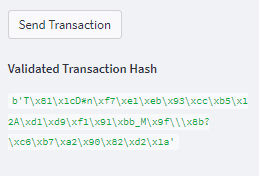
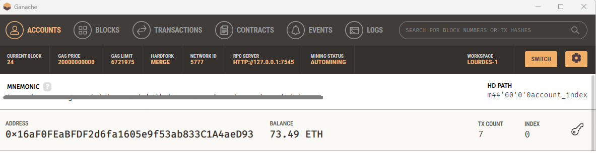

# Fintech Crypto Payments

This project entails building an application called Fintech Finder which customers can use to find fintech professionals from among a list of candidates, hire them, and pay them. The Ethereum blockchain network is integrated into the application in order to enable customers to instantly pay the fintech professionals whom they hire with cryptocurrency.

In this case, we assume the perspective of a Fintech Finder customer and do the following: 

* Generate a new Ethereum account instance by using a mnemonic seed phrase (created in Ganache).
* Fetch and display the account balance associated with that Ethereum account address.
* Calculate the total value of an Ethereum transaction, including the gas estimate, that pays a Fintech Finder candidate for their work.
* Digitally sign a transaction that pays a Fintech Finder candidate, and send this transaction to the Ganache blockchain.
* Review the transaction hash code associated with the validated blockchain transaction.

---

## Technologies

The whole project is implemented in Python, writen in Jupyter lab using Streamlit to launch and display the app in a user-friendly way. The ```Web3``` Library is used for the Blockchain transactions and functions: 

* ```import streamlit as st```
* ```from dataclasses import dataclass```
* ```from typing import Any, List```
* ```from web3 import Web3```
* ```w3 = Web3(Web3.HTTPProvider('HTTP://127.0.0.1:7545'))```

---

## Usage

NOTE: The `crypto_wallet.py` script file contains the support functions to run the main `fintech_finder.py` file. Make sure both are placed in the same directory before running.

Follow these steps to run the app:

1. From your terminal, navigate to the project folder that contains your `.env` file (with your mnemonic seed phrase provided by Ganache) and the `fintech_finder.py` and `crypto_wallet.py` files.

2. To launch the Streamlit application, type `streamlit run fintech_finder.py`.

3. On the resulting webpage, select a candidate that you would like to hire from the appropriate drop-down menu. Then, enter the number of hours that you would like to hire them for (consider the amount of ether in your account as a limit).


4. Click the Send Transaction button to sign and send the transaction with your Ethereum account information. If the transaction is successfully communicated to Ganache, validated, and added to a block, a resulting transaction hash code will be written to the Streamlit application sidebar.



5. Navigate to the Ganache accounts tab and locate your account (index 0). There you can see the address, balance, and transaction (TX) count.



With this, the hiring process and payment transaction have been completed.

---

## Contributors

Feature developed by Lourdes Dominguez [(LinkedIn profile)](https://www.linkedin.com/in/lourdes-dominguez-bengoa-12333044/)

---

## License

Use only for academic purposes.